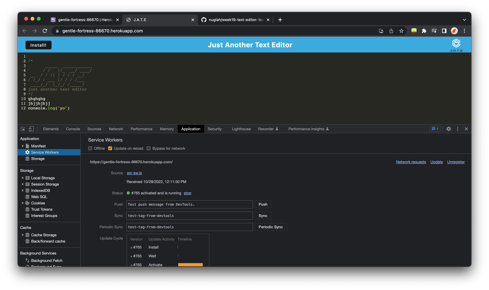
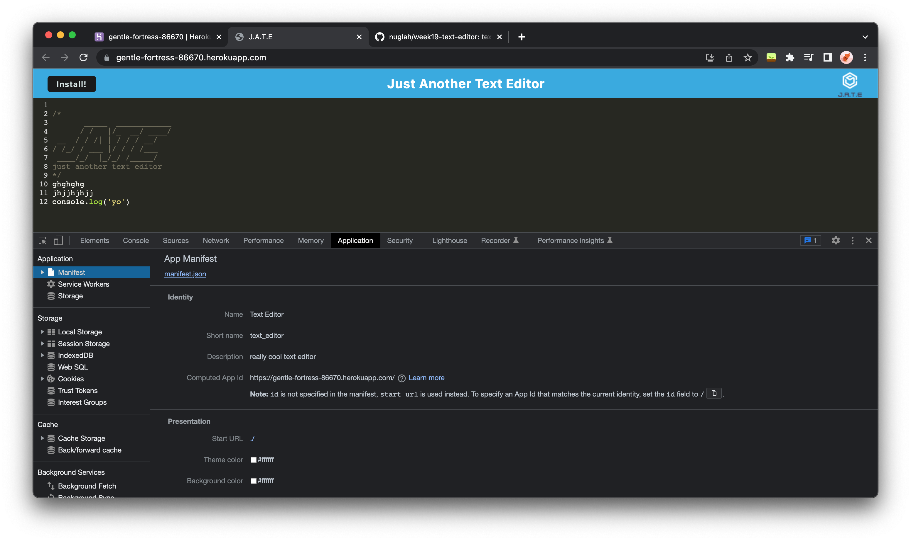
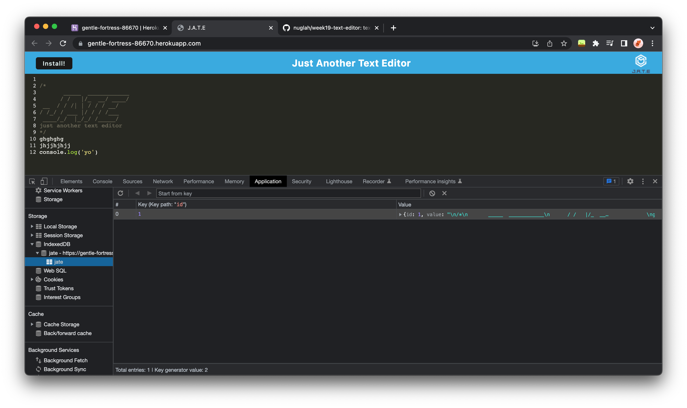

# Text-Editor

## Description

Used the starter code for a text editor application and set it up for the PWA standards. I used IndexedDb to store data from the app and configured a webpack with plugins for a mainifest file and also got the service worker set up. Added modules to the webpack for the css and babel for browser compatitbility. I also set up the install button fr installing the webpage as an application and for offline use.

## Installation

Deployed heroku app
https://gentle-fortress-86670.herokuapp.com/

## Usage

Typing test in the text editor will save it when clicked out of the editor and when the page is refreshed. Clicking the install button or the link in the url will install the webpage as an app to you computer. The app also has the ability t be used offline

